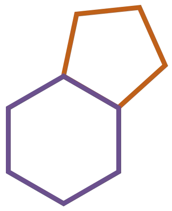

# Ribo

    

Ribo is a declarative programming language. 
Think something like JSON or YAML - but with types. And nicer.

But Ribo doesn't exist in a vacuum. 
Just as JSON is a declarative subset of Javascript, 
Ribo is a declarative subset of a family of languages, 
with the head of the family being [Pheno](http://pheno-lang.org).
With only one or two minor exceptions (noted at the time), everything you read here is equally valid for Pheno, too.

For an intro to Ribo see [intro.ribo](intro.ribo)
